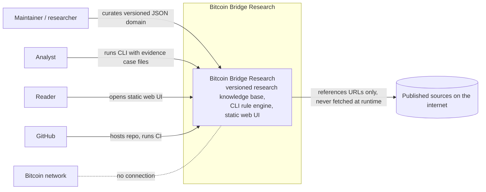
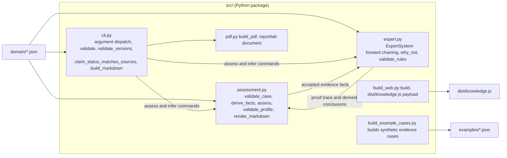
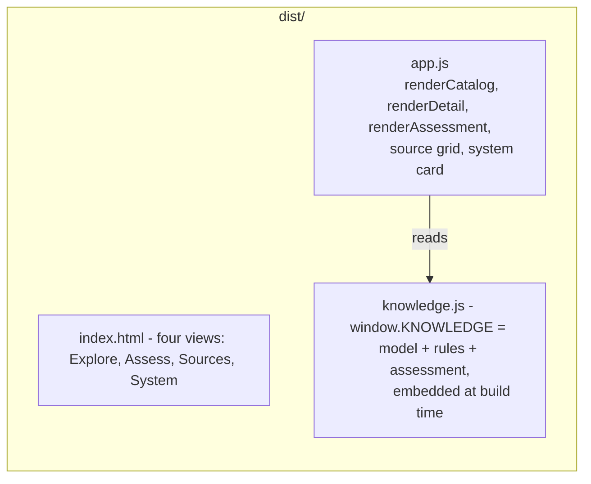
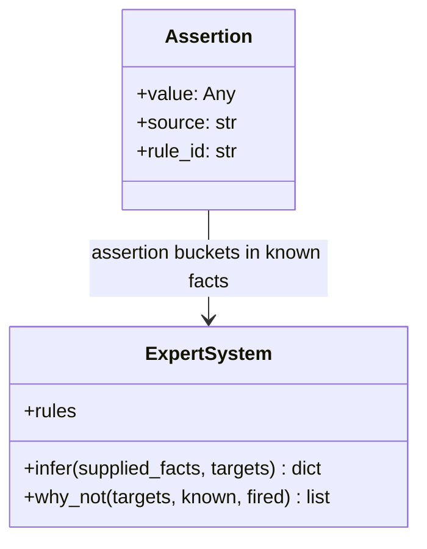

# Bitcoin Bridge Research — C4 Architecture

This is a C4 (Context, Containers, Components, Code) description of the repository, written to be honest about what this system is and is not. It is a discipline document that is itself checked by tests, not a promotional architecture diagram.

## Honest framing

This repository is **not a server-based software product**. There is no API, no database server, no user authentication, no runtime network traffic, and no Bitcoin-node access. C4's "containers" are therefore mapped to the repository's actual *runnable and deployable artifacts* plus the *versioned data store* that functions as its database. Connectors that are not drawn here are things that deliberately do not exist: the web UI never calls the assessment engine, and nothing queries a Bitcoin node.

## Level 1 — System Context



Honest notes:

- Three actors are drawn, but today the only real one is the maintainer. The UI has no registered external users and `evidence/claims/` is an empty directory.
- The Bitcoin network is deliberately not a dependency; nothing in the repository queries it. CI is the only runtime interaction with an external system.

### Snapshot contract

Checked by `ArchitectureDocTests` in `tests/test_artifacts.py`; this table must match the live knowledge files or CI fails.

| metric | value |
|---|---|
| model version | 0.2.0 |
| bitcoin capabilities | 3 |
| finance requirements | 6 |
| legal requirements | 5 |
| bridges | 7 |
| companies | 15 |
| sources | 8 |
| claims | 2 |
| assessment requirements | 12 |
| inference rules | 3 |
| fact registry facts | 20 |

## Level 2 — Containers

```mermaid
flowchart LR
    KB["Domain knowledge base
        versioned JSON source of truth
        functions as the database"]

    CLI["Research CLI (Python)"]
    WEB["Static web UI (browser)"]
    ART["Committed artifacts"]
    CI["CI pipeline"]

    WEB -->|reads embedded data, generated at build time| ART
    CLI -->|validates and reads| KB
    CLI -->|writes| ART
    CLI -. python -m src.build_web .-> WEB
    CI -->|clone, validate, rebuild-and-diff, unittest| KB
    CI -->|compares| ART
```

### Containers listed

**Domain knowledge base** — versioned, filesystem-backed source of truth, the repository's "database". Files: `domain/model.json`, `domain/rules.json`, `domain/facts.json`, `domain/assessments/custody-readiness.json`. Every other container reads it; nothing writes it at runtime (only the maintainer edits it).

**Research CLI** — the `src/` Python package. Everything except PDF generation runs on the Python standard library; `reportlab` is required only for `build-pdf`.

- CLI subcommands: `validate`, `build`, `build-pdf`, `infer`, `assess`.
- The argparse choices come from the `COMMANDS` constant in `src/cli.py`.

`build_web` and `build_example_cases` are invoked as `python -m` modules instead of CLI subcommands.

**Static web UI** — `dist/` is plain static files (`dist/index.html`, `dist/app.js`, `dist/knowledge.js`, `dist/styles.css`) for any static host. There is no server and no request-time computation. The questionnaire on the Assess view is a client-side sandbox and does not run the CLI engine.

**Committed artifacts** — generated outputs rebuilt from the domain knowledge base and committed for freshness-checking: `dist/knowledge.js`, `generated/market-map.md`, `output/pdf/domain-map.pdf`. The synthetic cases in `examples/*.json` and the PDF are regenerable, not hand-written.

**CI pipeline** — `.github/workflows/ci.yml` clones, validates domain and knowledge files, rebuilds the generated trees and fails if `git diff` is non-empty, and runs the full test suite.

## Level 3 — Components

### Container: Research CLI



- `src/cli.py` dispatches commands, validates the model, rule, and profile files, and enforces version parity and claim-status semantics.
- `src/assessment.py` validates evidence cases, derives facts only from accepted, applicable, in-scope, non-expired evidence, and maps them onto assessment requirements.
- `src/expert.py` runs deterministic open-world forward chaining ("missing facts remain unknown, never false") and produces proof traces.
- `src/pdf.py` renders the domain model to a PDF; the PDF footer states the model version to prevent it reading like an independent report.
- `src/build_web.py` serializes model + rules + assessment into `dist/knowledge.js`.
- `src/build_example_cases.py` regenerates the explicitly synthetic evidence cases in `examples/*.json`.

### Container: Static web UI (client-side only)



Note: `renderAssessment()` in `dist/app.js` only recombines the user's checkbox selections and labels the result "UNVERIFIED SANDBOX RESULT". It does not invoke `src/assessment.py`; only the CLI produces traceable, evidence-backed output. The diagram keeps the two disconnected on purpose.

## Level 4 — Code (key units, not exhaustive)



The following anchors are verified by `ArchitectureDocTests`: each `file:line` must exist, and the named function must be defined at that line.

- `src/cli.py:22` — `claim_status_matches_sources()`: a `corroborated` status requires at least two distinct sources.
- `src/cli.py:41` — `validate()`: duplicate ids, reference integrity, evidence levels, and per-source `checked_on` dates.
- `src/cli.py:110` — `build_markdown()`: the "Snapshot generated on" header and Sources appendix.
- `src/cli.py:146` — `validate_versions()`: model, rules, assessment and fact-registry versions must agree.
- `src/assessment.py:20` — `validate_case()`: evidence records must carry artifact, issuer, provenance, scope, and review blocks.
- `src/assessment.py:110` — `derive_facts()`: accepts evidence only if reviewed-accepted, jurisdiction-scoped, and time-valid; incompatible accepted assertions become a conflict.
- `src/assessment.py:153` — `assess()`: outcome ladder (`conflict`, `not_ready`, `insufficient_information`, `ready_for_expert_review`), then feeds satisfied/failed evidence facts into rules for derived conclusions.
- `src/assessment.py:277` — `validate_profile()`: assessment facts and control facts must be registered in the fact registry.
- `src/expert.py:31` — `infer()`: open-world forward chaining with proof traces and explicit conflict reporting.
- `src/expert.py:120` — `validate_rules()`: rule conditions and conclusions must reference registered facts.
- `src/pdf.py:118` — `build_pdf()`: renders only what `domain/model.json` contains; footer prints the model version.

## What this C4 hides (staying honest)

- **The "system" is mostly data, not code.** The knowledge files in `domain/` outsize the Python by far; validation treats the data as the authority.
- **Empty and degenerate surfaces:** `evidence/claims/` is empty, the paper-company index in `publications/v0.1.0/PAPER_COMPANIES.json` marks most companies illustrative-only, and the example evidence cases are synthetic.
- **No external consumers:** the three personas are aspirational; the only externally observable behavior is the CI pipeline.
- **No persistence:** the web UI keeps questionnaire state only in the DOM; closing the tab loses it.
- **The snapshot contract above is a point-in-time count**, not a guarantee of coverage; it exists so this document cannot silently drift from the model it describes.