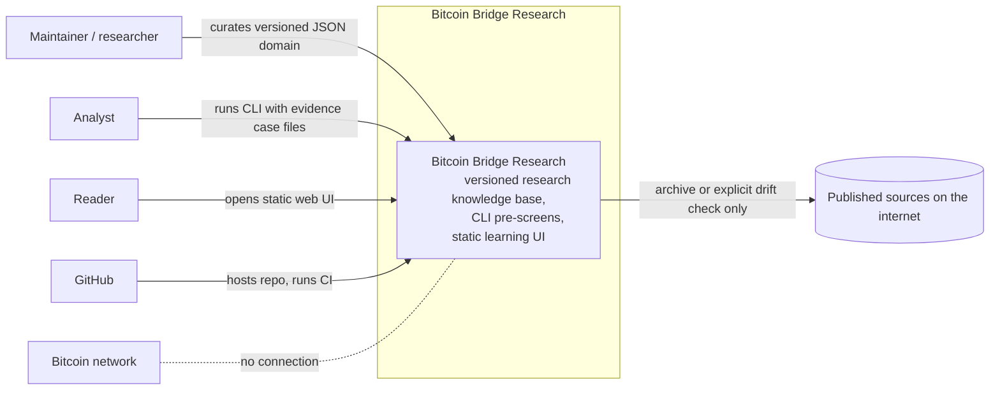
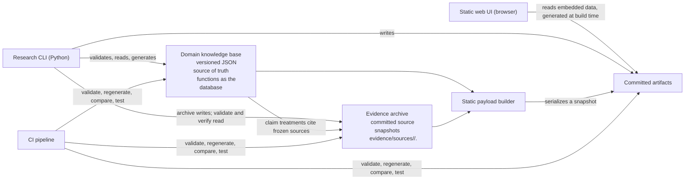
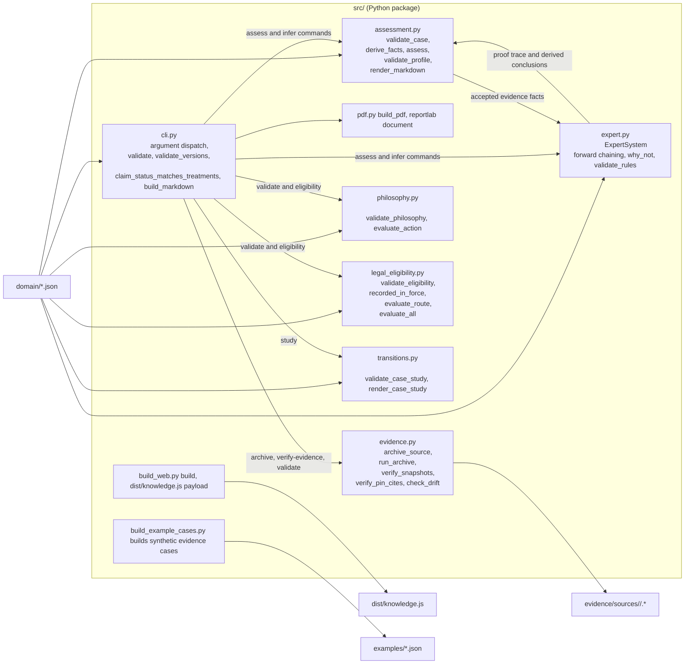
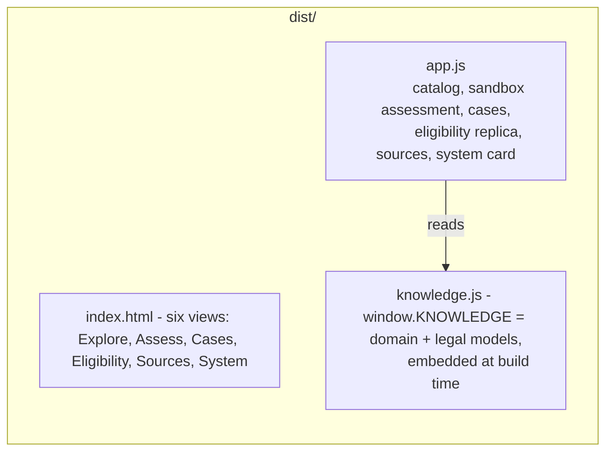
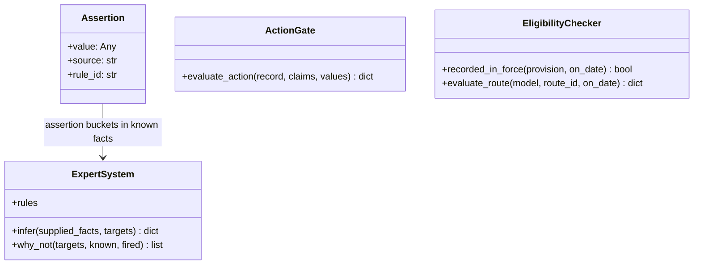

# Bitcoin Bridge Research — C4 Architecture

This is a C4 (Context, Containers, Components, Code) description of the repository, written to be honest about what this system is and is not. It is a discipline document that is itself checked by tests, not a promotional architecture diagram.

## Honest framing

This repository is **not a server-based software product**. There is no application API, database server, user authentication, persistent browser state, legal-data feed, or Bitcoin-node access. Normal inference and browser use are offline; the explicit `archive` and `verify-evidence --drift` operations make outbound HTTP requests. C4's "containers" are therefore the repository's actual *runnable and deployable artifacts* plus versioned files that function as its database. The web UI never calls the Python assessment, philosophy, or legal-eligibility engines, and nothing queries a Bitcoin node.

## Level 1 — System Context

Honest notes:

- Three roles are drawn, but the repository has no accounts, usage records, production deployment or evidence of adoption. The maintainer is the only demonstrated curator; analyst and reader are supported interaction modes, not established user populations. `evidence/claims/` is empty.
- The Bitcoin network is deliberately not a dependency; nothing verifies signatures, descriptors, transactions, UTXOs or chain state.
- GitHub CI is an external integration. Source archiving and explicit drift checking are the only application operations designed to contact source websites; the static UI opens external links only when a reader chooses one.

### Snapshot contract

Checked by `ArchitectureDocTests` in `tests/test_artifacts.py`; this table must match the live knowledge files or CI fails.

| metric | value |
|---|---|
| model version | 0.3.0 |
| bitcoin capabilities | 3 |
| finance requirements | 6 |
| legal requirements | 5 |
| bridges | 7 |
| companies | 15 |
| sources | 8 |
| archived source snapshots | 6 |
| claims | 2 |
| assessment requirements | 12 |
| inference rules | 3 |
| fact registry facts | 20 |
| philosophy stages | 5 |
| philosophy gates | 5 |
| legal eligibility authorities | 1 |
| legal eligibility provisions | 1 |
| legal eligibility routes | 5 |
| transition verified facts | 21 |
| transition pathways | 6 |

## Level 2 — Containers

### Containers listed

**Domain knowledge base** — versioned, filesystem-backed source of truth, the repository's "database". Files: `domain/model.json`, `domain/rules.json`, `domain/facts.json`, `domain/philosophy.json`, `domain/legal/allianz-y3-eligibility.json`, `domain/assessments/custody-readiness.json`. Every other container reads it; nothing writes it at runtime (only the maintainer edits it).

**Evidence archive** — committed source snapshots under `evidence/sources/`, described by `evidence/sources/manifest.json`. `archive` fetches each source, stores exact bytes at `evidence/sources/<id>/<sha256>.<ext>`, writes extracted text beside them, and records hash, size, retrieval time and result. Unavailable sources are recorded with their error. `validate` and ordinary `verify-evidence` operate offline; `verify-evidence --drift` re-fetches frozen sources. Only claim-cited sources must be frozen for validation to pass. None of the 16 Allianz case-study sources or the eligibility checker's TAR document is in this archive.

**Research CLI** — the `src/` Python package. It provides deterministic validation, inference, custody assessment, case-study rendering, legal-route pre-screening and artifact generation. Everything except PDF generation and PDF text extraction runs on the Python standard library; `reportlab` and `pypdf` are declared dependencies.

- CLI subcommands: `validate`, `build`, `build-pdf`, `infer`, `assess`, `study`, `eligibility`, `archive`, `verify-evidence`.
- The argparse choices come from the `COMMANDS` constant in `src/cli.py`.

`build_web` and `build_example_cases` are invoked as `python -m` modules instead of CLI subcommands.

**Static web UI** — `dist/` is plain static files (`dist/index.html`, `dist/app.js`, `dist/knowledge.js`, `dist/styles.css`) for any static host. There is no application server. Search, the questionnaire and legal-route matching execute locally in JavaScript against the generated snapshot. They do not call the Python engines, persist results, authenticate inputs, or refresh law and evidence.

**Committed artifacts** — `dist/knowledge.js`, `generated/market-map.md` and `output/pdf/domain-map.pdf` are regenerated and compared by CI. The hand-written UI shell and JavaScript are tested for selector integrity, not generated. The synthetic cases in `examples/*.json` are regenerable. The older publication PDF under `publications/v0.1.0/` is a release artifact, not rebuilt by current CI.

**CI pipeline** — `.github/workflows/ci.yml` validates knowledge files, rebuilds the three current generated artifacts, compares them for drift, runs the complete unit suite, then runs the C4 contract tests separately. CI does not fetch live legal sources, run `archive`, run `verify-evidence --drift`, deploy the UI, or obtain professional review.

## Level 3 — Components

### Container: Research CLI

- `src/cli.py` dispatches commands, validates model, rules, assessment, philosophy and legal-eligibility files, and enforces version parity and claim-status semantics. It does not currently call `validate_case_study()` during global validation.
- `src/assessment.py` validates evidence cases, derives facts only from accepted, applicable, in-scope, non-expired evidence, and maps them onto assessment requirements.
- `src/expert.py` runs deterministic open-world forward chaining ("missing facts remain unknown, never false") and produces proof traces.
- `src/pdf.py` renders the domain model to a PDF; the PDF footer states the model version to prevent it reading like an independent report.
- `src/build_web.py` serializes the model, rules, assessment, decision architecture and legal-eligibility model into `dist/knowledge.js`.
- `src/build_example_cases.py` regenerates the explicitly synthetic evidence cases in `examples/*.json`.
- `src/evidence.py` freezes what claims cite: it archives source bytes, records hashes and extracted text, and verifies offline that every claim-cited source is frozen and every pin-cite quote appears in the frozen text.
- `src/philosophy.py` validates the five-stage ontology → data → epistemology → axiology → action specification. Only `evaluate_action()` is a runtime gate; the first four gates are declarations and are not applied record-by-record across the corpus.
- `src/legal_eligibility.py` validates one narrow Lithuanian eligibility model, compares curator-recorded force dates, and maps five predefined routes to closed output statuses. It does not fetch TAR, authenticate a legal text, follow amendments, perform look-through analysis, or decide disputed applicability.
- `src/transitions.py` validates and renders the Allianz research case when invoked directly or through `study`; its sources are URL-linked and quote-bearing but are not part of the content-addressed evidence archive.

### Container: Static web UI (client-side only)

The browser contains two deliberately limited replicas:

- `renderAssessment()` recombines unverified radio selections. It does not invoke `src/assessment.py`, validate evidence records, derive facts, run rules, or emit a proof trace.
- `routeStatus()` repeats a subset of `src/legal_eligibility.py` in JavaScript. It checks `recorded_status === "in_force"` but, unlike the Python function, does not compare commencement or expiry dates to the selected date. There is no selected-date control. The tests verify shipped data and basic behavior, not semantic parity between both implementations.

The System view renders the philosophy specification, but does not execute `evaluate_action()`.

## Level 4 — Code (key units, not exhaustive)

The following anchors are verified by `ArchitectureDocTests`: each `file:line` must exist, and the named function must be defined at that line.

- `src/cli.py:26` — `claim_status_matches_treatments()`: a `corroborated` status requires at least two distinct current supporting sources; `contested`, `retracted`, and `stale` must match the cited treatments and source currency.
- `src/cli.py:79` — `validate()`: duplicate ids, reference integrity, evidence levels, per-source `checked_on` dates, source currency and `superseded_by`, claim treatments, frozen source snapshots, and pin-cite quotes.
- `src/cli.py:183` — `build_markdown()`: the "Snapshot generated on" header, treatment locators, and the archived Sources appendix.
- `src/cli.py:240` — `validate_versions()`: model, rules, assessment and fact-registry versions must agree.
- `src/evidence.py:135` — `archive_source()`: fetches a source, stores it at `evidence/sources/<id>/<sha256>.<ext>`, and records hash, size, and extracted text.
- `src/evidence.py:198` — `run_archive()`: archives every source, recording unavailable fetches instead of hiding them.
- `src/evidence.py:245` — `verify_snapshots()`: every frozen file must hash-match its manifest entry, and every claim-cited source must be frozen.
- `src/evidence.py:270` — `verify_pin_cites()`: each treatment must carry a literal locator that appears before a quote found in the frozen source text.
- `src/evidence.py:317` — `check_drift()`: re-fetches frozen sources and reports any whose bytes changed.
- `src/assessment.py:20` — `validate_case()`: evidence records must carry artifact, issuer, provenance, scope, and review blocks.
- `src/assessment.py:110` — `derive_facts()`: accepts evidence only if reviewed-accepted, jurisdiction-scoped, and time-valid; incompatible accepted assertions become a conflict.
- `src/assessment.py:153` — `assess()`: outcome ladder (`conflict`, `not_ready`, `insufficient_information`, `ready_for_expert_review`), then feeds satisfied/failed evidence facts into rules for derived conclusions.
- `src/assessment.py:277` — `validate_profile()`: assessment facts and control facts must be registered in the fact registry.
- `src/expert.py:31` — `infer()`: open-world forward chaining with proof traces and explicit conflict reporting.
- `src/expert.py:120` — `validate_rules()`: rule conditions and conclusions must reference registered facts.
- `src/pdf.py:122` — `build_pdf()`: renders only what `domain/model.json` contains; footer prints the model version.
- `src/philosophy.py:15` — `validate_philosophy()`: requires the five ordered stages, relation vocabulary, gates, minimum action fields and invariants.
- `src/philosophy.py:59` — `evaluate_action()`: blocks prohibited or unauthorized actions, unmet claim thresholds and missing or unknown values; success means only eligible for human decision.
- `src/legal_eligibility.py:19` — `validate_eligibility()`: requires official-source metadata and structurally complete provisions and routes.
- `src/legal_eligibility.py:46` — `recorded_in_force()`: compares a requested date to curator-recorded commencement and end dates; it does not verify those dates externally.
- `src/legal_eligibility.py:55` — `evaluate_route()`: classifies only predefined routes and never treats absence of a matching prohibition as established permission.
- `src/transitions.py:22` — `validate_case_study()`: checks case structure, source references, blockers and pathway vocabulary, but not source authenticity or legal correctness.

## What this C4 hides (staying honest)

- **The "system" is mostly data, not code.** The knowledge files in `domain/` outsize the Python by far; validation treats the data as the authority.
- **Empty and degenerate surfaces:** `evidence/claims/` is empty, the paper-company index in `publications/v0.1.0/PAPER_COMPANIES.json` marks most companies illustrative-only, and assessment evidence cases are synthetic. The Allianz Y3 transition study is project-authored, source-linked research—not a submitted institutional case, legal opinion, regulatory determination or investment recommendation.
- **The archive is partial, and says so:** 6 of 8 sources are frozen with hashes and pin-cite quotes; the two OCC documents (both on `occ.gov`) were unreachable from the archiving host and are recorded as `unavailable` with their errors. Only claim-cited sources are required to be frozen, so requirement references to unfrozen sources remain. Pin cites are machine-checked against frozen text, but that text is extracted, not an independent attestation.
- **Legal status is asserted, not monitored:** the eligibility model contains one authority, one provision and five hand-classified routes. Its TAR identity, quoted text, commencement date and `in_force` flag are curator-entered. No connector checks the official register, amendments, repeal, case law, hierarchy, territorial scope or entity/instrument applicability. “Recorded in force” is intentionally weaker than “valid law governing this decision.”
- **ELI-aligned is not ELI validation:** the legal JSON borrows a few ELI property names. It is not RDF/JSON-LD, has not been checked against the ELI ontology or validator, and does not ingest an ELI feed. Akoma Ntoso is listed as a possible future representation but is not installed or used.
- **The philosophy is mostly a contract:** five stages and gates are modeled and validated, but only the final action gate has executable record evaluation. Existing claims, cases, rules and assessments have not been migrated through all five gates.
- **Duplicated browser logic can drift:** the web assessment and eligibility checker are hand-written JavaScript approximations, not clients of the Python engines. Generated data freshness is enforced; full behavior equivalence is not.
- **No established external consumers:** roles in the context diagram express supported use, not adoption. There are no accounts, analytics, saved sessions, submitted institutional evidence, expert sign-offs or production service-level claims.
- **No persistence:** browser inputs live only in the DOM; closing or refreshing the tab loses them. There is no audit log of browser activity.
- **No automatic legal or market surveillance:** CI is offline with respect to official sources. The system cannot warn that a law, fund document, company product, link or factual claim changed unless a maintainer explicitly runs a networked check and curates the result.
- **No recommendation engine:** outcomes such as `prohibited`, `professional_interpretation_required` and `eligible_for_human_decision` are pre-screen labels. They do not establish suitability, fiduciary compliance, expected return, proportionality, or what Allianz should do.
- **The snapshot contract above is a point-in-time count**, not a guarantee of coverage; it exists so this document cannot silently drift from the model it describes.
